# Spring IO 2017
## Build complex Spring Boot microservices architecture using JHipster

### Develop and Deploy Microservices with JHipster
> This instruction is adapted from a similar instruction written by Matt Raible [here](https://github.com/mraible/microservices-for-the-masses/blob/master/demos/jhipster-microservices/TUTORIAL.md). This has been updated to reflect the latest changes in JHipster and to use a different combination of micro services and entities. I highly recommend you check the original instruction out if you wanna try out Kubernetes deployment.

> Learn how to develop a microservice architecture with JHipster, Spring Boot, Angular, MySQL and MongoDB and deploy it all using Docker.

This tutorial shows you how to build a microservices architecture with [JHipster 4.4.1](https://jhipster.github.io/2017/05/08/jhipster-release-4.4.1.html). 
You'll generate a gateway (powered by Netflix Zuul and the JHipster Gateway), a microservice (that talks to MongoDB), a microservice that talks to MySQL and use Docker Compose to deploy it all.

## What is JHipster?

JHipster is one of those open-source projects you stumble upon and immediately think, "`Of course!`" It combines three 
very successful frameworks in web development: Bootstrap, Angular, and Spring Boot. Bootstrap was one of the first dominant 
web-component frameworks. Its largest appeal was that it only required a bit of HTML and it worked! All the efforts we 
made in the Java community to develop web components were shown a better path by Bootstrap. It leveled the playing field 
in HTML/CSS development, much like Apple's Human Interface Guidelines did for iOS apps.

JHipster was started by Julien Dubois in October 2013 (Julien's first commit was on 
[October 21, 2013](https://github.com/jhipster/generator-jhipster/commit/c8630ab7af7b6a99db880b3b0e2403806b7d2436)). The 
first public release (version 0.3.1) was launched December 7, 2013. Since then, the project has had over 130 releases! 
It is an open-source, Apache 2.0-licensed project on GitHub. It has a core team of 19 developers and over 320 contributors. 
You can find its homepage at [http://jhipster.github.io](http://jhipster.github.io/). If you look at 
[the project on GitHub](https://github.com/jhipster/generator-jhipster), you can see it's mostly written in JavaScript 
(39%) and Java (27%).

At its core, JHipster is a [Yeoman](http://yeoman.io/) generator. Yeoman is a code generator that you run with a `yo` 
command to generate complete applications or useful pieces of an application. Yeoman generators promote what the Yeoman 
team calls the "`Yeoman workflow`". This is an opinionated client-side stack of tools that can help developers quickly 
build beautiful web applications. It takes care of providing everything needed to get working without the normal pains 
associated with a manual setup.

## Install JHipster 4

The [Installing JHipster](http://jhipster.github.io/installation/) instructions show you all the tools you'll need to 
use a released version of JHipster.

1. Install Java 8 [from Oracle](http://www.oracle.com/technetwork/java/javase/downloads/index.html).
2. Install Git from <https://git-scm.com>.
3. Install Node.js from <http://nodejs.org>.
4. Install Yarn using the [Yarn installation instructions](https://yarnpkg.com/en/docs/install) * You can also choose to use NPM if you like
5. Run the following command to install [Yeoman](http://yeoman.io/).

    ```
    yarn global add yo
    ```

6. Run the following command to install JHipster.

    ```
    yarn global add generator-jhipster
    ```

## Microservices with JHipster 

To build a microservices architecture with JHipster, you'll need to generate three applications, and clone another.

* Generate a gateway
* Generate a store microservice
* Generate a CMS microservice
* Clone the JHipster Registry [This is required only if you are planning to run the setup locally]

You can see how these components fit in the diagram below.


To see what's happening inside your applications, you can use the [JHipster Console](https://jhipster.github.io/monitoring/#jhipster-console), 
a monitoring tool based on the [ELK Stack](https://www.elastic.co/products). I'll cover this tool in the Docker Compose 
section.

## Create an API Gateway

To create a gateway project, open a terminal window and create a `jhipster-springio-example` directory. Then 
create a `gateway` directory for the gateway application. 

```bash
mkdir gateway && cd gateway
```

In JHipster terms, a **gateway** is a normal JHipster application. This means you can develop 
it like a monolith, but it also acts as the entrance to your microservices. More specifically, it provides HTTP 
routing and load balancing, rate limiting, quality of service, security, and API documentation for all microservices.

In the `gateway` directory run `yo jhipster`. 

You'll be asked a number of questions about the type of  application you want to generate and what features you'd like 
to include. Create the `blog` application with the following settings:

* Application type: `Microservice gateway`
* Base name of the application: `gateway`
* Install other generators from the JHipster Marketplace: `No`
* Port: `8080`
* Default package name: `com.springio.store`
* Type of authentication: `JWT`
* Service Discovery and Configuration: `JHipster Registry`
* Type of database: `SQL`
* Production database: `MySQL`
* Development database: `H2 with disk-based persistence`
* Hibernate 2nd-level cache: `Yes, with HazelCast`
* Maven or Gradle: `Gradle`
* Other technologies: `None`
* Client framework: `Angular 4`
* Sass for CSS: `No`
* Internationalization support: `Yes`
* Native language: `English`
* Additional languages: `Catalan`
* Testing frameworks: `Protractor`

If you'd like to use the same settings I did, you can place the following `.yo-rc.json` file in the `gateway` directory 
and run `yo jhipster` in it. You won't be prompted to answer any questions because the answers are already in `.yo-rc.json`.

```json
{
  "generator-jhipster": {
    "jhipsterVersion": "4.4.1",
    "baseName": "gateway",
    "packageName": "com.springio.store",
    "packageFolder": "com/springio/store",
    "serverPort": "8080",
    "authenticationType": "jwt",
    "hibernateCache": "hazelcast",
    "clusteredHttpSession": false,
    "websocket": false,
    "databaseType": "sql",
    "devDatabaseType": "h2Disk",
    "prodDatabaseType": "mysql",
    "searchEngine": false,
    "messageBroker": false,
    "serviceDiscoveryType": "eureka",
    "buildTool": "gradle",
    "enableSocialSignIn": false,
    "jwtSecretKey": "6343f4fc4212df1318c4101f1c98bf677a4fd79b",
    "clientFramework": "angular2",
    "useSass": false,
    "clientPackageManager": "yarn",
    "applicationType": "gateway",
    "testFrameworks": [
      "protractor"
    ],
    "jhiPrefix": "jhi",
    "enableTranslation": true,
    "nativeLanguage": "en",
    "languages": [
      "en",
      "ca"
    ]
  }
}
```

The project creation process will take a couple minutes to run, depending on your internet connection speed. When it's 
finished, you should see output suggesting that the app was generated succesfully.

Before you can run this project, you'll need to download and start a instance of the [JHipster Registry](https://github.com/jhipster/jhipster-registry).
You can either clone and run the project 

```bash
git clone git@github.com:jhipster/jhipster-registry.git registry
cd registry && ./mvnw
```
or download a pre built `war` from the [releases page](https://github.com/jhipster/jhipster-registry/releases) and run it locally.

```bash
java -jar ./jhipster-registry-3.0.1.war
```

The [JHipster Registry](https://jhipster.github.io/microservices-architecture/#jhipster-registry) is built on Spring 
Cloud Netflix and Spring Cloud Config. Patterns provided by Spring Cloud Netflix include Service Discovery (Eureka),  
Circuit Breaker (Hystrix), Intelligent Routing (Zuul), and Client Side Load Balancing (Ribbon). 

Run `./gradlew` to start the gateway application and navigate to <http://localhost:8080> in your favorite browser. The first 
thing you'll notice is a dapper-looking fellow explaining how you can sign in or register.

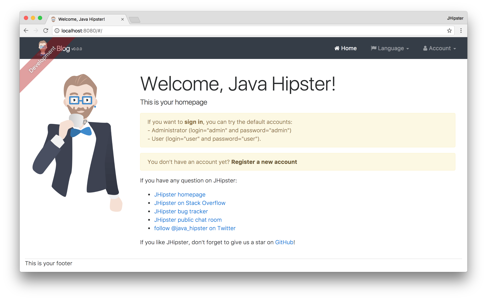

Sign in with username `admin` and password `admin` and you'll have access to navigate through the Administration section. 
This section offers nice looking UIs on top of some Spring Boot's many monitoring and configuration features. It also 
allows you to administer users:

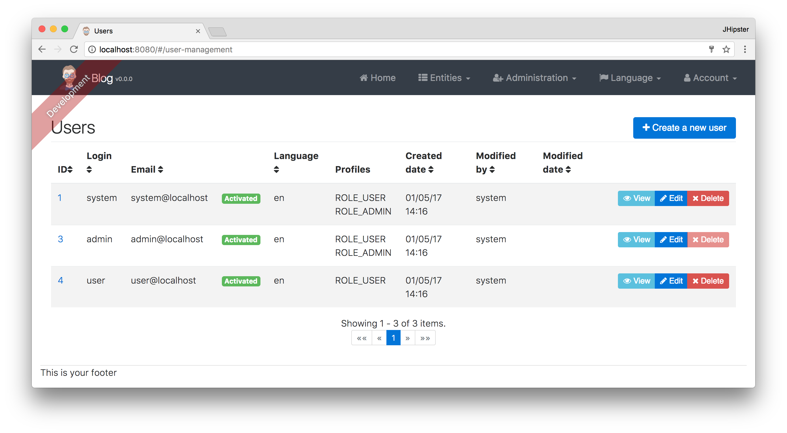

It gives you insights into Application and JVM metrics:

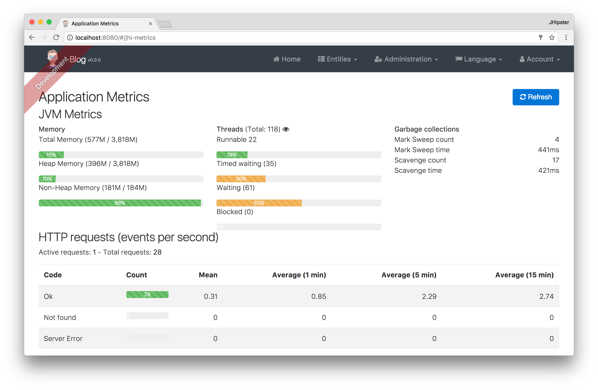

And it allows you to see the Swagger docs associated with its API.

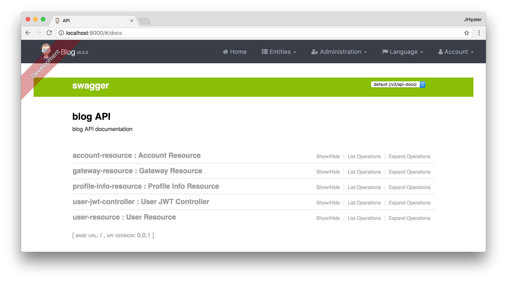

You can run the following command (in a separate terminal window) to run the Protractor tests and confirm everything is 
working properly.

```bash
yarn e2e
```

At this point, it's a good idea to check your project into Git so you can easily see what changes are made going forward.

```bash
git init
git add .
git commit -m "Gateway created"
```

## Create a Store Microservice

To generate a `store` microservice, open a terminal window and navigate to the `jhipster-springio-example` directory.
Create a `store` directory and run `yo jhipster` in it. Use the following settings to generate a microservice that uses 
mySQL for its database.

* Application type: `Microservice application`
* Base name of the application: `store`
* Install other generators from the JHipster Marketplace: `No`
* Port: `8081`
* Default package name: `com.springio.store`
* Type of authentication: `JWT`
* Service Discovery and Configuration: `JHipster Registry`
* Type of database: `SQL`
* Production database: `MySQL`
* Development database: `H2 with disk-based persistence`
* Hibernate 2nd-level cache: `Yes, with HazelCast`
* Maven or Gradle: `Gradle`
* Other technologies: `None`
* Internationalization support: `Yes`
* Native language: `English`
* Additional languages: `Catalan`
* Testing frameworks: `None`

Here is the `.yo-rc.json` for the same

```json
{
  "generator-jhipster": {
    "jhipsterVersion": "4.4.1",
    "baseName": "store",
    "packageName": "com.springio.store",
    "packageFolder": "com/springio/store",
    "serverPort": "8081",
    "authenticationType": "jwt",
    "hibernateCache": "hazelcast",
    "clusteredHttpSession": false,
    "websocket": false,
    "databaseType": "sql",
    "devDatabaseType": "h2Disk",
    "prodDatabaseType": "mysql",
    "searchEngine": false,
    "messageBroker": false,
    "serviceDiscoveryType": "eureka",
    "buildTool": "gradle",
    "enableSocialSignIn": false,
    "jwtSecretKey": "4ba90cafa98abf06a7f8fe1b4c0b717c37b5eafb",
    "enableTranslation": true,
    "applicationType": "microservice",
    "testFrameworks": [],
    "jhiPrefix": "jhi",
    "skipClient": true,
    "skipUserManagement": true,
    "nativeLanguage": "en",
    "languages": [
      "en",
      "ca"
    ],
    "clientPackageManager": "yarn"
  }
}

```

Once its done you should see a message saying app generated succesfully

Start the service using Gradle (You can also run the main class form your IDE)

```bash
./gradlew
```
The service should appear in the Gateway page under administration of the Gateway app we created.

Commit your changes to Git. It's always a good idea to do this before generating entities.

```bash
git commit -a -m "Generated store application"
```

## Create a CMS Microservice

To generate a `cms` microservice, open a terminal window and navigate to the `jhipster-springio-example` directory.
Create a `cms` directory and run `yo jhipster` in it. Use the following settings to generate a microservice that uses 
MongoDB for its database.

* Application type: `Microservice application`
* Base name of the application: `cms`
* Install other generators from the JHipster Marketplace: `No`
* Port: `8082` *Make sure its not conflicting with the service created earlier
* Default package name: `com.springio.store`
* Type of authentication: `JWT`
* Service Discovery and Configuration: `JHipster Registry`
* Type of database: `MongoDB`
* Maven or Gradle: `Gradle`
* Other technologies: `None`
* Internationalization support: `Yes`
* Native language: `English`
* Additional languages: `Catalan`
* Testing frameworks: `None`

Here is the `.yo-rc.json` for the same

```json
{
  "generator-jhipster": {
    "jhipsterVersion": "4.4.1",
    "baseName": "cms",
    "packageName": "com.springio.store",
    "packageFolder": "com/springio/store",
    "serverPort": "8082",
    "authenticationType": "jwt",
    "hibernateCache": "no",
    "clusteredHttpSession": false,
    "websocket": false,
    "databaseType": "mongodb",
    "devDatabaseType": "mongodb",
    "prodDatabaseType": "mongodb",
    "searchEngine": false,
    "messageBroker": false,
    "serviceDiscoveryType": "eureka",
    "buildTool": "gradle",
    "enableSocialSignIn": false,
    "jwtSecretKey": "171453e4e96a4156e5cb32b92ba762380580ec37",
    "enableTranslation": true,
    "applicationType": "microservice",
    "testFrameworks": [],
    "jhiPrefix": "jhi",
    "skipClient": true,
    "skipUserManagement": true,
    "nativeLanguage": "en",
    "languages": [
      "en",
      "ca"
    ],
    "clientPackageManager": "yarn"
  }
}

```

Once its done you should see a message saying app generated succesfully

Start the service using Gradle (You can also run the main class form your IDE)

```bash
./gradlew
```
The service should appear in the Gateway page under administration of the Gateway app we created.

Commit your changes to Git. It's always a good idea to do this before generating entities.

```bash
git commit -a -m "Generated CMS application"
```

### Generate Entities for store

For each entity you want to create, you will need:

* a database table;
* a Liquibase change set;
* a JPA entity class;
* a Spring Data `JpaRepository` interface;
* a Spring MVC `RestController` class;
* an Angular model, state, component, dialog components, service; and
* several HTML pages for each component.

In addition, you should have integration tests to verify that everything works and performance tests to verify that it 
runs fast. In an ideal world, you'd also have unit tests and integration tests for your Angular code.

The good news is JHipster can generate all of this code for you, including integration tests and performance tests. In 
addition, if you have entities with relationships, it will generate the necessary schema to support them (with foreign 
keys), and the TypeScript and HTML code to manage them. You can also set up validation to require certain fields as well as control their length.

What is even cooler is that JHipster can create the backend code for entities in a microservice and automatically create the appropriate front end code in the gateway.

JHipster supports several methods of code generation. The first uses its [entity sub-generator](https://jhipster.github.io/creating-an-entity/). 
The entity sub-generator is a command-line tool that prompts you with questions which you answer. 
[JDL-Studio](https://jhipster.github.io/jdl-studio/) is a browser-based tool for defining your domain model with JHipster 
Domain Language (JDL). Finally, [JHipster-UML](https://jhipster.github.io/jhipster-uml/) is an option for those that like UML. 
Supported UML editors include [Modelio](https://www.modeliosoft.com/), [UML Designer](http://www.umldesigner.org/), 
[GenMyModel](https://www.genmymodel.com/), and [Visual Paradigm](http://www.visual-paradigm.com/). I like the visual 
nature of JDL-Studio, so I'll use it for this project.

Below is the entity diagram and JDL code needed to generate a simple store app schema

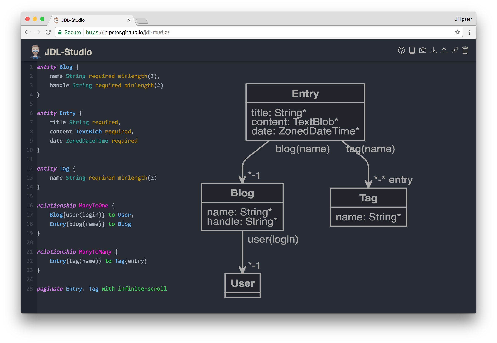

You can copy/paste the contents of the file below to your hard 
drive if you'd like to follow along.

```
entity Brand {
	name String required,
    startDate Instant
}

entity Product {
    name String,
    description String,
    image ImageBlob,
    price BigDecimal,
    size Size,
    availableUntil Instant
}

entity Category {
    name String,
    status CategoryStatus
}

enum CategoryStatus {
    AVAILABLE, RESTRICTED, DISABLED
}

enum Size {
	S, M, L, XL, XXL
}

entity SubCategory {
	name String
}

relationship OneToMany {
	Brand{product} to Product{brand(name)},
    Category{subcategory} to SubCategory{category(name)}
}

relationship ManyToMany {
	Product{subcategory(name)} to
    SubCategory{product}
}

paginate Category, SubCategory  with pagination
paginate Product with infinite-scroll
service * with serviceClass
microservice * with store

```

Run the following command (in the `store` directory) to import this file. Running this command will generate backend for entities and Junit integration tests.

```bash
yo jhipster:import-jdl ./jhipster-jdl.jh
```

You'll be prompted to overwrite `src/main/resources/config/liquibase/master.xml`. Type `a` to overwrite this file, as 
well as others.

Start the application with `/.gradlew` if its not running already. If you already have it running then either recompile using `./gradlew compileJava` or using your IDE.

Now we need a front end for this. Navigate to the gateway folder and run these commands

```bash
cd ../gateway
yo jhipster:import-jdl ../store/jhipster-jdl.jh
```

JHipster will automatically create appropriate front end for the entities since we have declared `microservice * with store` in the JDL

Now run `yarn start` if its not running already to view the UI for the generated entities. Create a couple 
Brand for the existing `admin` and `user` users, as well as a few Categories, Sub Categories and few Product entries.


Commit all your changes to Git.

```
git add .
git commit -m "Entities generated"
```

### Generate Catalog Entity for CMS app

Create a Catalog entity by running the following command in the `cms` directory.

```bash
yo jhipster:entity catalog
```

Use the following answers for the questions asked:

* Do you want to add a field to your entity? `Yes`
* What is the name of your field? `name`
* What is the type of your field? `String`
* Do you want to add validation rules to your field? `Yes`
* Which validation rules do you want to add? `Required`

* Do you want to add a field to your entity? Yes
* What is the name of your field? catType
* What is the type of your field? Enumeration (Java enum type)
* What is the class name of your enumeration? CatalogType
* What are the values of your enumeration (separated by comma)? X, XL, XXL
* Do you want to add validation rules to your field? No

* Do you want to add a field to your entity? `No`

* Do you want to use a Data Transfer Object (DTO)? `No`
* Do you want to use separate service class for your business logic? `Yes, generate a separate service class`
* Do you want pagination on your entity? `Yes, with pagination links`

Your terminal should look similar to the following after you've answered all these questions.

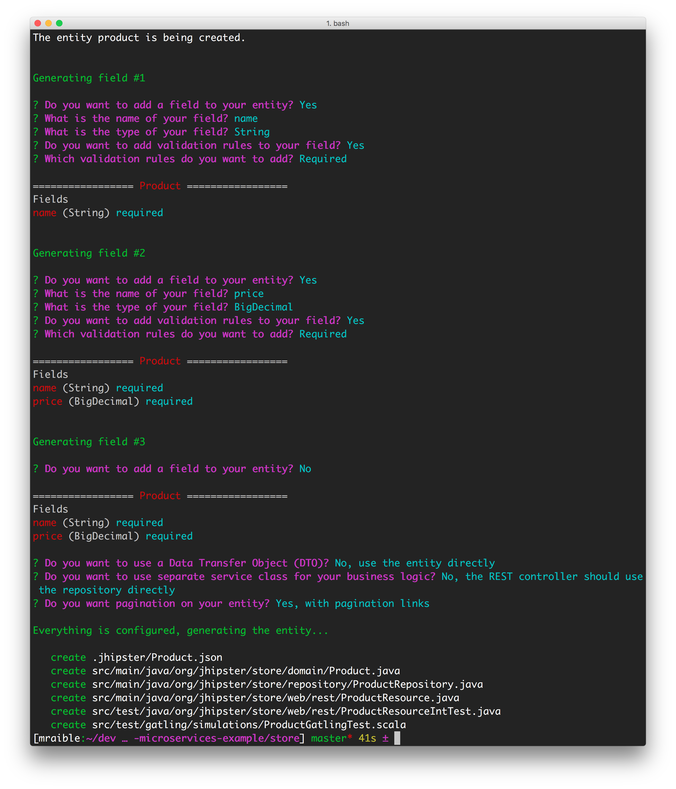

### Generate UI for Catalog Entity

Since a microservice only contains the server-side code for the entities it contains. To generate
an Angular UI for the product, navigate to the `gateway` directory and run the same command.

```bash
yo jhipster:entity catalog
```

Use the following answers for the questions asked:

* Do you want to generate this entity from an existing microservice? `Yes`
* Enter the path to the microservice root directory: `../cms`
* Do you want to update the entity? `Yes`

A visual of these questions and answers is in the screenshot below.

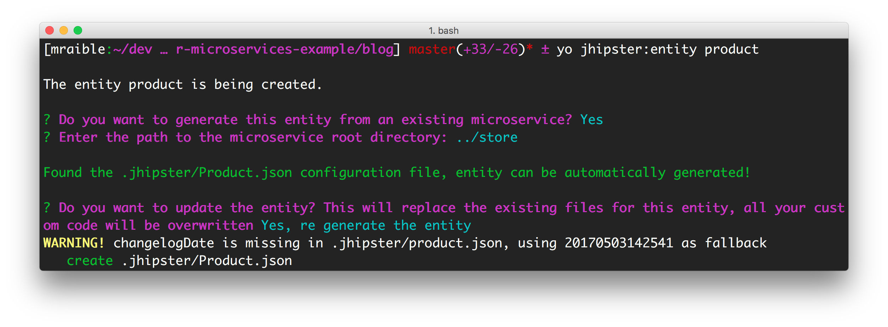

Commit your changes to Git.

```
git commit -a -m "Add catalog entity"
```

At this point, you should be able to verify everything works by starting the registry, gateway, store, cms and MongoDB.
You can run MongoDB using Docker Compose and the following command in the `cms` directory.

```bash
docker-compose -f src/main/docker/mongodb.yml up
```

The [Docker Compose](#docker-compose) section shows how you can run all your services using Docker.

Navigate to `http://localhost:8080`, login with admin/admin, and go to Entities > Catalog. You should be able to
add an item and see that it has a MongoDB identifier.


## Build for Production

A JHipster application can be deployed anywhere a Spring Boot application can be deployed. Its Angular client is
bundled inside its JAR files

JHipster ships with support for deploying to [Cloud Foundry](https://jhipster.github.io/cloudfoundry/), 
[Heroku](https://jhipster.github.io/heroku/), [Kubernetes](https://jhipster.github.io/kubernetes/), 
[AWS](https://jhipster.github.io/aws/), [AWS with Boxfuse](https://jhipster.github.io/boxfuse/) and
[Openshift](https://jhipster.github.io/openshift/)

When you prepare a JHipster application for production, it's recommended to use the pre-configured "`production`" profile. 
With Gradle, you can package your application by specifying the `prod` profile when building.

```bash
./gradlew -Pprod bootRepackage
```

The production profile is used to build an optimized JavaScript client. You can invoke this using webpack by running 
`yarn run webpack:prod`. The production profile also configures gzip compression with a servlet filter, cache headers, 
and monitoring via [Metrics](https://github.com/dropwizard/metrics). If you have a [Graphite](http://graphite.wikidot.com/) 
server configured in your `application-prod.yaml` file, your application will automatically send metrics data to it.

## Deploy using Docker

What good is a microservices architecture if it's not deployed to a PaaS (Platform as a Service)? PaaS providers
are also known as "the cloud", and allow you to easily deploy and scale microservices as needed. Docker provides
a mechanism to "package" your applications as an entire bundle. A Docker container includes the operating system and 
services needed to run your application. Often, Docker containers are used for the individual components of your 
architecture. For example, you'll have a Docker container for each app, as well as one for PostgreSQL, MongoDB, and
Elasticsearch.

To complete this section, you'll need to [install Docker](https://docs.docker.com/engine/installation/).

**NOTE:** If you're not on Mac or Windows, you may need to [install Docker Compose](https://docs.docker.com/compose/install/) as well.

<a name="docker-compose"></a>
### Run with Docker Compose

Docker Compose is a tool for defining and running multi-container Docker applications. With Compose, you can create and 
start all the components of your application with a single command.

1. Make sure Docker is running.
2. Build Docker images for the `blog` and `store` applications by running the following command in both directories:

    ```
    mvn package -Pprod docker:build
    ```
    
3. Using your terminal, navigate to the root directory of your project, and create a `docker` directory. Then run the 
[JHipster Docker Compose sub-generator](https://jhipster.github.io/docker-compose/#docker-compose-subgen) in it.

    ```
    yo jhipster:docker-compose
    ````
    
    * Application type: `Microservice application`
    * Root directory of your microservices: `../`
    * Applications to include: `blog` and `store`
    * Applications with clustered databases: `None`
    * Setup monitoring: `JHipster Console with ELK/Zipkin`
    * The admin password for the JHipster Registry: `admin`
    
    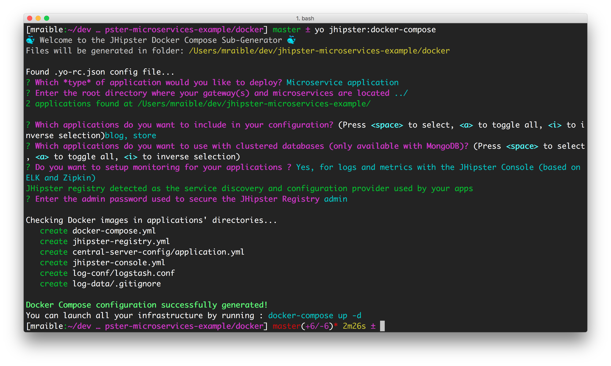
    
4. Run `docker-compose up` to run all your services and see the logs in the same window. Add `-d` if you want to run 
them as a daemon.
    
5. Use [Kitematic](https://kitematic.com/) to view the ports and logs for the services deployed.

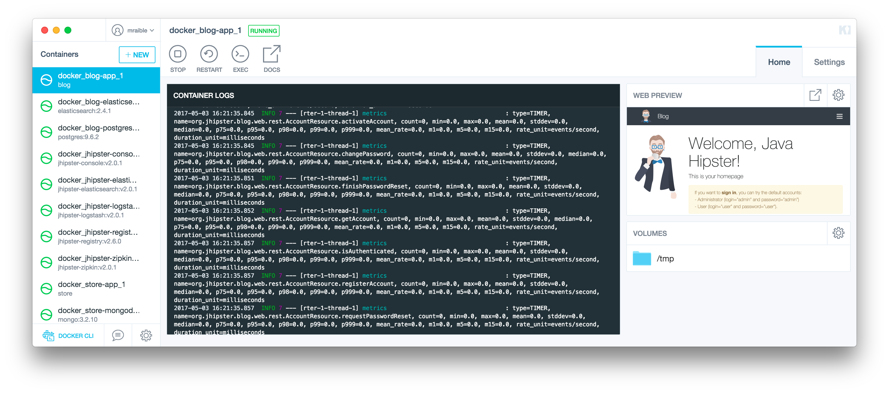

You can view the JHipster Registry at <http://localhost:8761>.

To produce data for the JHipster Console to display, run some Gatling tests in the `blog` app.

```bash
mvn gatling:execute
```

These simulations can take a while (> 10m) to complete. When they're finished, you can view their pretty reports.

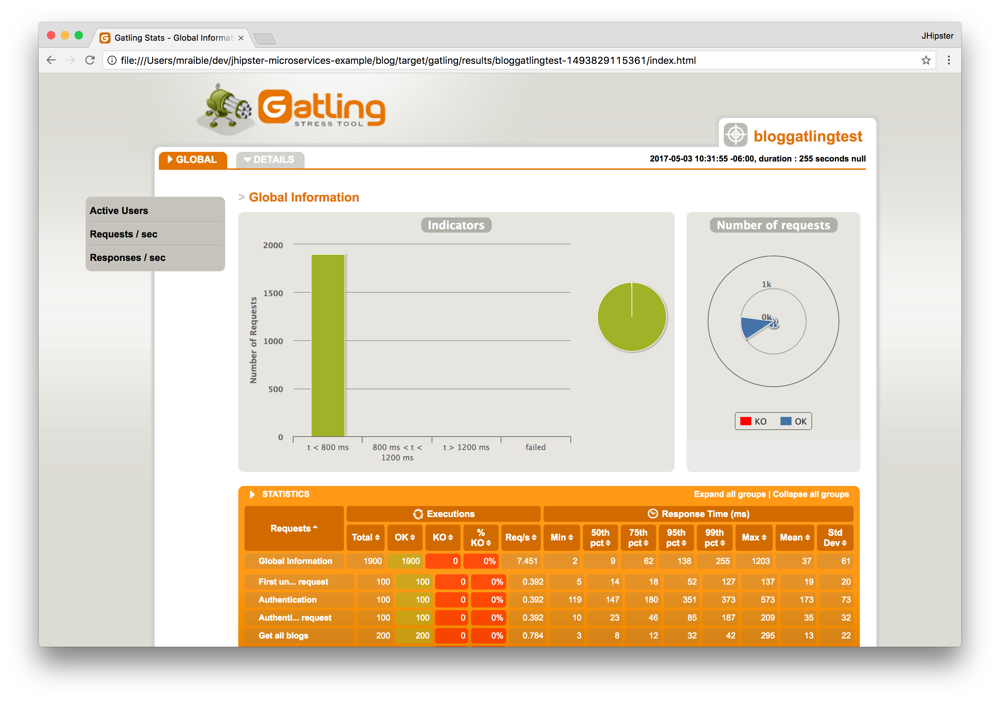

You can view the JHipster Console at <http://localhost:5601>. Navigate to Dashboards > Open to view some pre-built
dashboards for the JVM, logs, metrics, microservices, and performance. The screenshots below show you what some of 
these look like.

<table style="width: 100%">
<tr>
<td><a href="static/dashboard-jvm.png">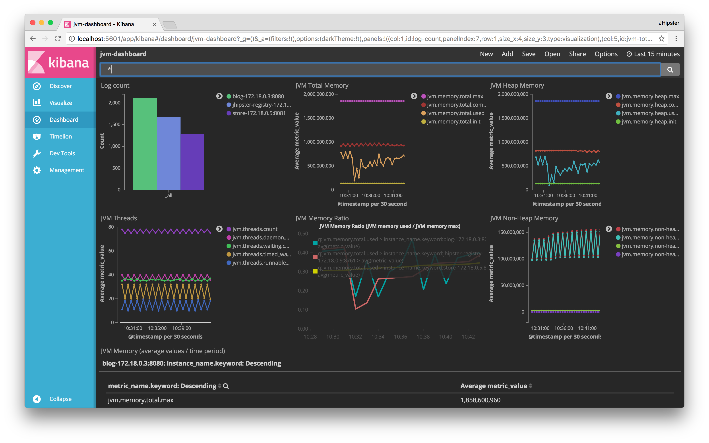</a></td>
<td><a href="static/dashboard-microservices.png">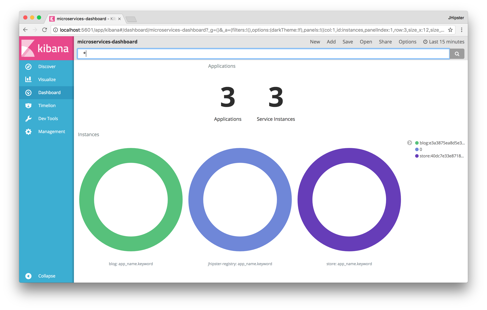</a></td>
<td><a href="static/dashboard-performance.png">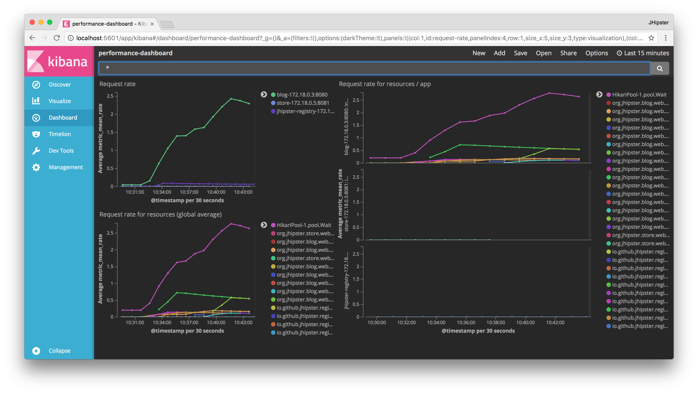</a></td>
</tr>
</table>

To save your changes for Docker Compose, commit your changes to Git.

```
git commit -a -m "Add Docker Compose"
```

### Run with Kubernetes and Minikube

[Kubernetes](https://kubernetes.io/) is an open-source system for automating deployment, scaling, and management of 
containerized applications. It was developed at Google over the last 16 years and was internally called Borg. To deploy
Docker containers with Kubernetes, you setup a cluster, then deploy to it. The context can be local (with Minikube), or 
remote (e.g. a Raspberry Pi cluster, Google Cloud, AWS, OpenShift, etc.).

Follow the steps below to use Kubernetes to deploy to a local cluster.

1. Install [kubectl](https://kubernetes.io/docs/tasks/kubectl/install/), [VirtualBox](https://www.virtualbox.org/wiki/Downloads), 
and [Minikube](https://github.com/kubernetes/minikube/releases).
2. Start Minikube using `minikube start`.
3. To be able to work with the docker daemon, run the following command in your terminal:

   ```bash
   eval $(minikube docker-env)
   ```
  
4. Create Docker images of the `blog` and `store` applications:
   
    ```bash
    mvn package -Pprod docker:build
    ```
      
5. Using your terminal, navigate to the root directory of your project, and create a `kubernetes` directory. Then run the 
[JHipster Kubernetes sub-generator](https://jhipster.github.io/kubernetes/) in it.

    ```
    yo jhipster:kubernetes
    ````
    
    * Application type: `Microservice application`
    * Root directory of your microservices: `../`
    * Applications to include: `blog` and `store`
    * The admin password for the JHipster Registry: `admin`
    * Kubernetes namespace: `default`
    * Base Docker repository name (e.g. mraible): `<your-docker-hub-username>`
    * Command to push Docker image to repository: `docker push`
    
    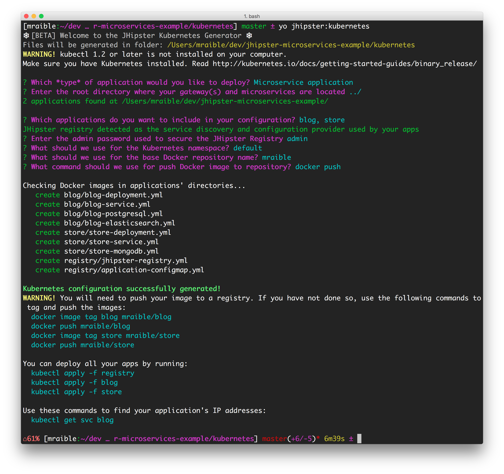
  
6. Run the following commands to tag your Docker images. The Kubernetes sub-generator says to run `docker push` as well, 
but you don't need that for a Minikube deployment.

    ```bash
    docker image tag blog mraible/blog
    docker image tag store mraible/store
    ```
    
7. Run the following commands in the `kubernetes` directory to deploy to Minikube. 

    ```
    kubectl apply -f registry
    kubectl apply -f blog
    kubectl apply -f store
    ```
    
    The deployment process can take several minutes to complete. Run `minikube dashboard` to see the deployed containers.
    
    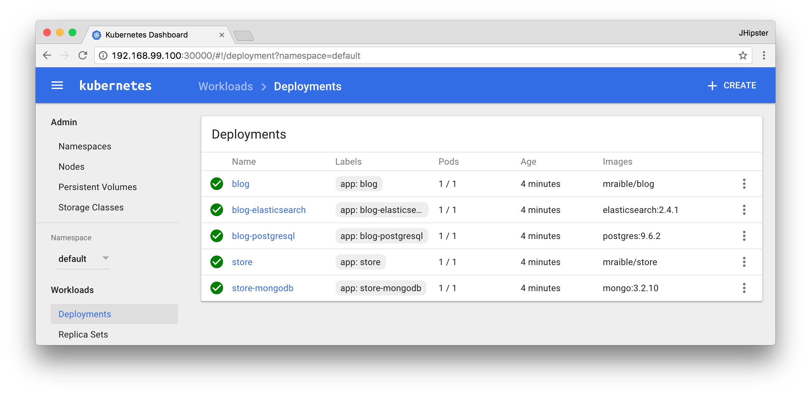
    
    You can also run `kubectl get po -o wide --watch` to see the status of each pod.

8. Run `minikube service blog` to view the blog application. You should be able to login and add blogs, entries, and products.

To remove all deployed containers, run the following command:

    kubectl delete deployment --all
    
To stop Minikube, run `minikube stop`.

To save your changes for Kubernetes, commit your changes to Git from the top-level directory.

```
git commit -a -m "Kubernetes"
```

### Deploy to Google Cloud

Google Cloud is a PaaS that's built on Google's core infrastructure. It's one of the easiest providers to get Kubernetes 
working with. Completed the steps below to deploy your hip microservices to Google Cloud. If you completed the Minikube
section above, open a new terminal window to reset things.

1. Create a Google Cloud project at [console.cloud.google.com](https://console.cloud.google.com/).
2. Navigate to <https://console.cloud.google.com/kubernetes/list> to initialize the Container Engine for your project. 
3. Install [Google Cloud SDK](https://cloud.google.com/sdk/) and set project using:
  
       gcloud config set project <project-name>

4. Create a cluster:
  
       gcloud container clusters create <cluster-name> --machine-type=n1-standard-2 --scopes cloud-platform --zone us-west1-a
       
   To see a list of possible zones, run `gcloud compute zones list`.
   
5. Push the `blog` and `store` docker images to [Docker Hub](https://hub.docker.com/). You will need to create an account 
and run `docker login` to push your images. The images can be run from any directory.

    ```bash
    docker image tag blog mraible/blog
    docker push mraible/blog
    docker image tag store mraible/store
    docker push mraible/store
    ```

6. Run `kubectl` commands to deploy.

    ```bash
    kubectl apply -f registry
    kubectl apply -f blog
    kubectl apply -f store
    ```

7. Use port-forwarding to see the registry app locally.

       kubectl port-forward jhipster-registry-0 8761:8761
    
8. Run `kubectl get service blog` to get the external IP of the blog application on Google Cloud. Open 
`http://<external-ip>:8080` to view your running application and verify everything works.

9. Scale microservice apps as needed with `kubectl`:

       kubectl scale --replicas=3 deployment/store
       
If you got everything working, congratulations! It's not easy learning all this new stuff.

## Screencast

To see a screencast by Matt Raible on building microservices with JHipster and deploying to Google Cloud, 
[watch this YouTube video](https://youtu.be/dgVQOYEwleA).

<div style="max-width: 560px; margin: 0 auto">
<iframe width="560" height="315" src="https://www.youtube.com/embed/dgVQOYEwleA?ecver=1" frameborder="0" allowfullscreen></iframe>
</div>

## Learn More about JHipster and Microservices

I hope you've enjoyed learning how JHipster can help you develop hip microservice architectures! It's a nifty project, with an 
easy-to-use entity generator, a pretty UI and many Spring Boot best-practice patterns. The project team follows five 
simple [policies](https://jhipster.github.io/policies/), paraphrased here:

1. The development team votes on policies.
2. JHipster uses technologies with their default configurations as much as possible.
3. Only add options when there is sufficient added value in the generated code.
4. For the Java code, follow the default IntelliJ IDEA formatting and coding guidelines.
5. Use strict versions for third-party libraries.

These policies help the project maintain its sharp edge and streamline its development process. If you have features you'd 
like to add or if you'd like to refine existing features, you can [watch the project on GitHub](https://github.com/jhipster/generator-jhipster)
and [help with its development](https://github.com/jhipster/generator-jhipster/blob/master/CONTRIBUTING.md) and support. 
We're always looking for help!

If you have questions about JHipster, please [ask me on Twitter](https://twitter.com/deepu105) or post a question to 
Stack Overflow with the ["jhipster" tag](http://stackoverflow.com/questions/tagged/jhipster).

You might also find the following resources interesting:

* [Doing Microservices with JHipster](https://jhipster.github.io/microservices-architecture/)
* [Building a Microservices Architecture for Microbrews](TBD on Okta Dev Blog)
* [Bootstrapping Your Microservices Architecture with JHipster and Spring](https://blog.heroku.com/bootstrapping_your_microservices_architecture_with_jhipster_and_spring)
* [Microservice Resources from Chris Richardson](http://microservices.io/resources/index.html)
